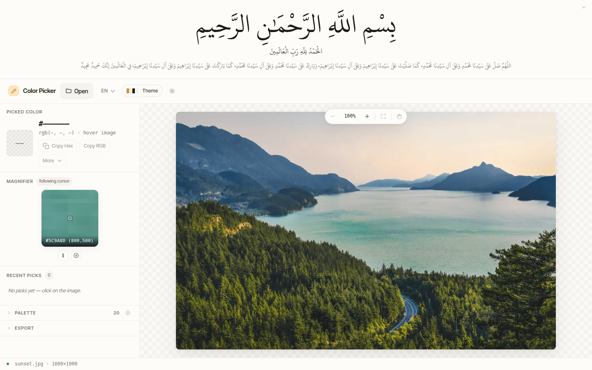
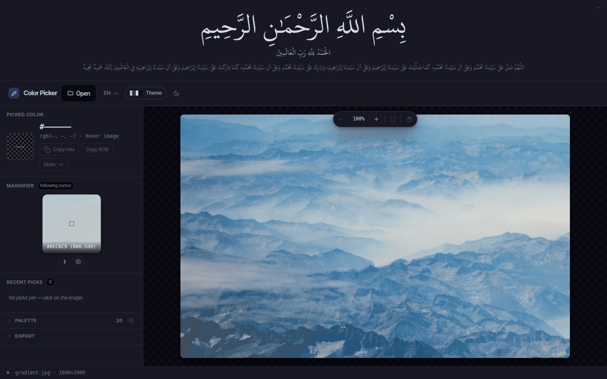
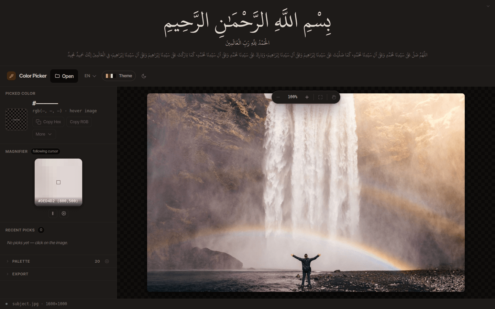

# Color Picker

Single-file browser tool. Drop an image, pick any pixel, copy the hex. Extract a palette. Export to JSON, CSS, Tailwind, Markdown, SVG, prompt.

**Live demo:** [abdullah-alnahas.github.io/color-picker](https://abdullah-alnahas.github.io/color-picker/)

## Demo

A vibrant landscape on the light theme — range of greens, blues, and warm sky tones.

A misty gradient on the dark midnight theme — shows subtle transitions and the picker's precision.

Auto-theme follows the image — UI accents pulled from the source colors.

## Features

- Pixel-perfect color picking with magnifier
- Image palette extraction (configurable bucket size + count)
- 7 theme palettes + dark/light + **auto** mode (theme follows your image)
- English, Arabic (RTL), Turkish
- Color formats: HEX, HEX8 (alpha), RGB, RGBA, HSL, HSV, OKLCH, CMYK
- Persisted history of recent picks (50 max) + undo on clear
- Touch: pinch zoom, two-finger pan, long-press magnifier
- Keyboard: `+`/`-` zoom, `0` fit, `H` hand, `F` freeze magnifier, `C` copy hex, `Enter`/`Space` pick from palette/history, `Delete` remove history entry, `Esc` close panels
- Zero network: runs entirely in your browser

## Run

Open [the live demo](https://abdullah-alnahas.github.io/color-picker/), or open `index.html` directly in any browser.

## License

MIT
